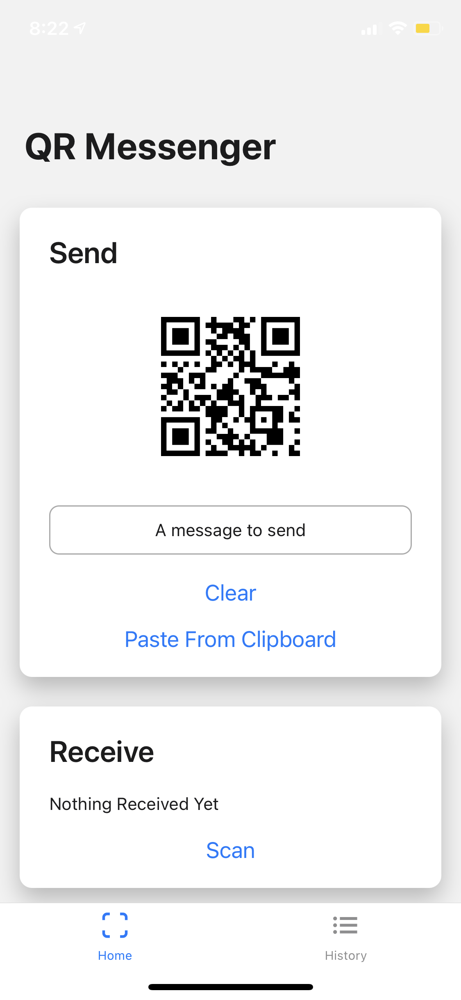
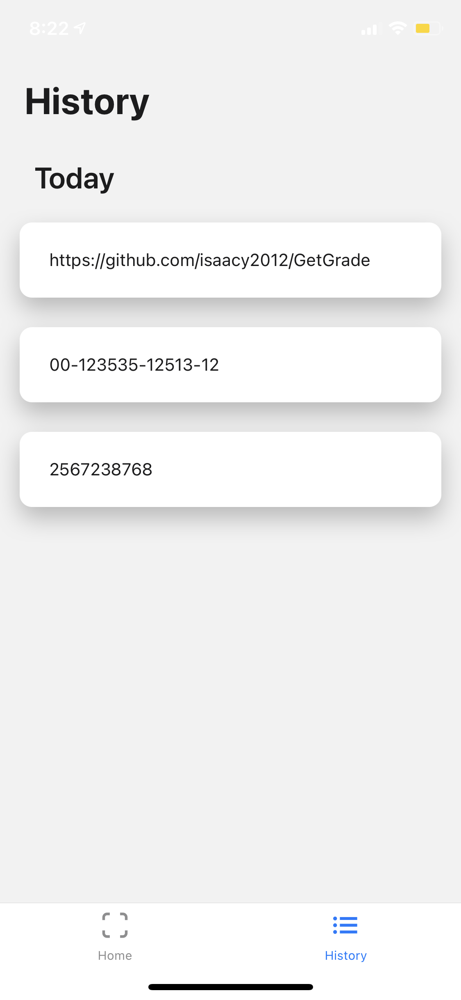
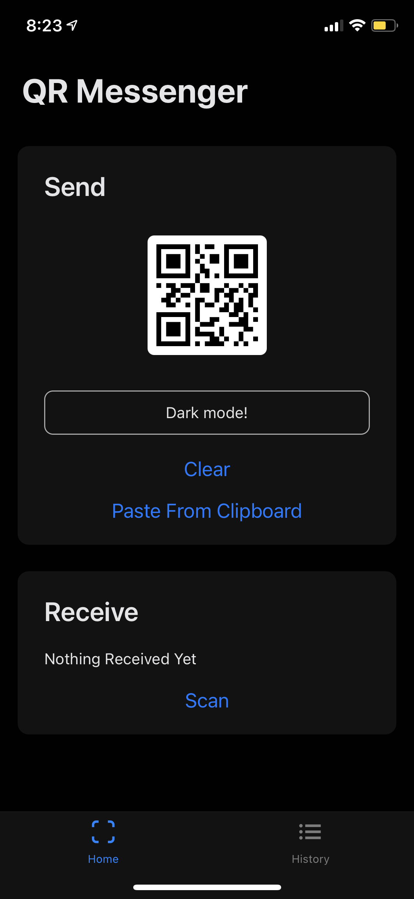
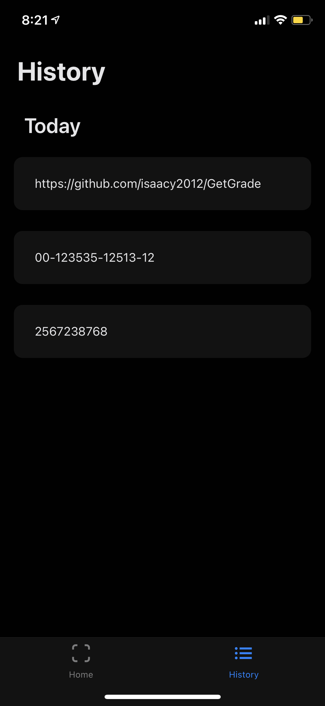

# QRMessenger
An app built with React Native to send and recieve data completely offline with QR Codes

  
  
  
  
 

<b>Send data to any phone without any mobile or internet connection</b>
Eliminate the hassle of copying long numbers or text by simply sending it through QRMessenger.

<b>Send even if they don't have the app</b>
As long as the recipient can scan QR codes, you can send data to them.

<b>Cross platform</b>
Works with both iOS and Android

<b>History</b>
See all your recieved messages in the History tab, and show their qr codes or copy them into your clipboard.

<b>Features</b>
- Instantly generate QR Codes of text/numbers
- Scan and copy QR Code data to clipboard
- Store data to access later
- Dark mode

